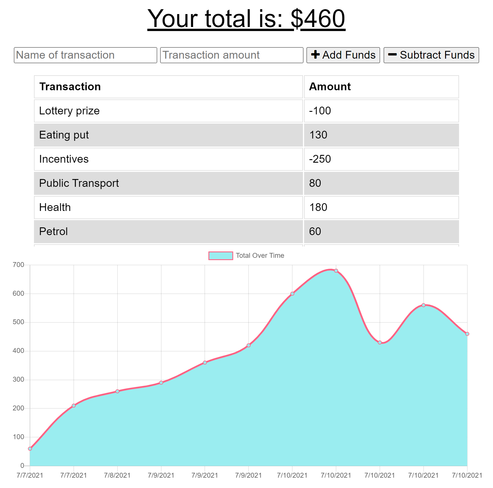

<h1 align="center"> Budget Tracker </h1>

<p align="center">
    
    
    
    
</p>

## Table of Contents

- [Table of Contents](#table-of-contents)
- [Description](#description)
- [User Story](#user-story)
- [Business Context](#business-context)
- [Acceptance Criteria](#acceptance-criteria)
- [Packages](#packages)
- [Repo link](#repo-link)
- [HEROKU Deployed link](#heroku-deployed-link)
- [Screenshots - Landing page](#screenshots---landing-page)
- [App Developer](#app-developer)

## Description

Adding offline accessibility and functionality to an existing online Budget Tracker application. The user will be able to add expenses and deposits to their budget with or without a connection. When entering transactions offline, they should populate the total when brought back online.

The follwoing functionality will be implemented:
  1. Offline Functionality:
       - Enter `deposits` offline
       - Enter `expenses` offline
  2. When brought back online:
       - Offline `entries should be added` to tracker.

## User Story

```
AS AN avid traveller
I WANT to be able to track my withdrawals and deposits with or without a data/internet connection
SO THAT my account balance is accurate when I am traveling
```

## Business Context
```
Giving users a fast and easy way to track their money is important, but allowing them to access that information anytime is even more important. Having offline functionality is paramount to our applications success.
```

## Acceptance Criteria
```
GIVEN a user is on Budget App without an internet connection
WHEN the user inputs a withdrawal or deposit
THEN that will be shown on the page, and added to their transaction history when their connection is back online.
```

## Packages
  * [compression](https://www.npmjs.com/package/compression) *- Compression in `Node. js` and `Express` decreases the downloadable amount of data that's served to users.*
  * [express](https://www.npmjs.com/package/express) *- Fast, unopinionated, minimalist web framework for `node`.*
  * [lite-server](https://www.npmjs.com/package/lite-server) *- Lite-server is a lightweight development `server` that serves a web application, opens it in the browser, and refreshes the page when `HTML or JavaScript` changes are made to the source code.*
  * [mongoose](https://www.npmjs.com/package/mongoose) *- Mongoose is a MongoDB object modeling tool designed to work in an asynchronous environment. *
  * [morgan](https://www.npmjs.com/package/morgan) *- HTTP request logger middleware for node.js*
  * [shield-io](https://shields.io/) *- for readme file*

## Repo link
[Workout Tracker Repo](https://github.com/marora7926/budget-tracker)

## HEROKU Deployed link
[Workout Tracker Application](https://budget-tracker-ma.herokuapp.com/)

## Screenshots - Landing page


## App Developer
```
Mohit ARORA
Email: mohitcoder2021@gmail.com
Repo: https://github.com/marora7926
```
- - -
© 2021 Mohit Arora. Confidential and Proprietary. All Rights Reserved.